# rusty-battleship

> 📝 **Disclaimer** I may be adding some stuff here, but for the most part I consider this exercise done - the game flow is covered by a test. What's left out is the client to render the play-fields and relay commands to the server, and (ironically) the WebSocket communication part.

Implement a multiplayer version of the *Battleship* game ([wiki](https://en.wikipedia.org/wiki/Battleship_(game))) with Rust and Svelte (?) and communication over WebSockets.

### Constraints

- protocol is optimised for lean payload (with some exceptions for convenience)
- server has authority over game state
- server does not expose other player's ships
- client does not keep track of previous state history, ie. it always renders from the last known state update

### Game sequence

The server is waiting for two players, who first place their available ships on the play-field, then take turns and shoot at other player's field. After each move the server sends updated map and current game state. The game continues until one of the players wins.

```mermaid
sequenceDiagram
    Client A ->> Server: 🤝 connect
    Server ->> Client A: ⏳ waiting for player B
    Client B ->> Server: 🤝 connect
    Server ->> Client B: ⏳ waiting for your ships
    Server ->> Client A: ⏳ waiting for your ships
    Client A ->> Server: 🚢 place ship at XY
    Server ->> Client A: 📦 updated map
    Server ->> Client A: ⏳ waiting for B's ships
    Client B ->> Server: 🚢 place ship at XY
    Server ->> Client B: 📦 updated map
    Server ->> Client B: ⏳ waiting for A's shot
    Server ->> Client A: ⏳ waiting for your shot
    Client A ->> Server: 🎯 shoot at XY
    Server ->> Client A: 📦 updated map
    Server ->> Client A: ⏳ waiting for B's shot
    Client B ->> Server: 🎯 shoot at XY
    Server ->> Client B: 📦 updated map
    Server ->> Client B: 🥈 player A wins
    Server ->> Client A: 🥇 you win
```

### Payload

Since we know the size of the field beforehand, we can optimise the payload.

#### Point XY

A Point can be encoded in a single byte, with the left-most 4 bits corresponding to X, and the right-most 4 bits to Y coordinates.

#### Fields and state

A Map 10x10 can be encoded as a series of 100 bits, where each bit says if the corresponding cell on the field is marked (1) or not (0) -- then we can represent the whole field as two Maps (ships and shots).

The whole game state update can then be represented in 4 Maps:
1. my ships
2. all shots on my fields
3. all shots on enemy field (not passing ships to prevent cheating)
4. hits on enemy fields

> 📝 For convenience, I will actually pass a Map as 128 bits to keep encoding/decoding a bit simpler and focus on delivering the whole thing earlier.
